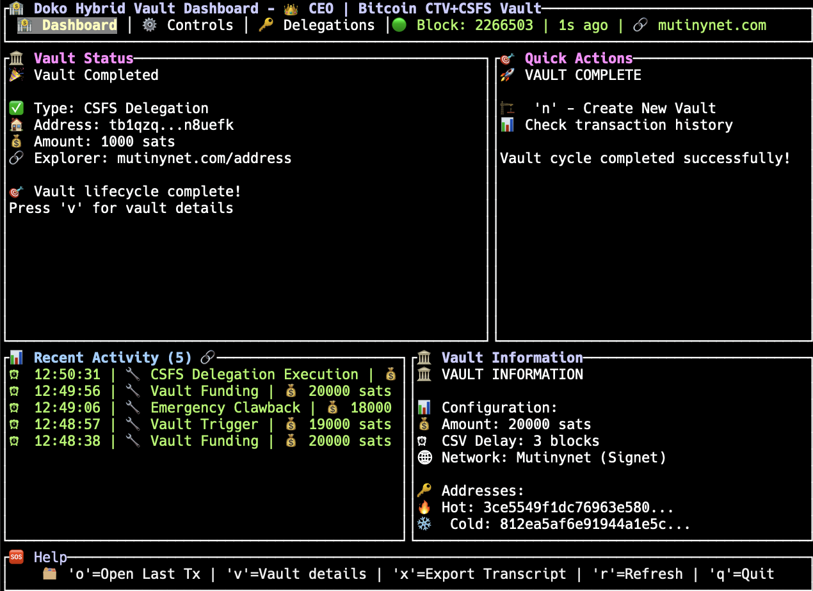

<div align="center">
  
  
  # Doko
  
  **Bitcoin CTV & CSFS Proof-of-Concept Showcase**
  
  [](https://crates.io/crates/bitcoin-doko)
  [](https://bitcoin.org/bitcoin.pdf)
  [](https://github.com/AbdelStark/doko/blob/main/LICENSE)
  
  *A comprehensive collection of Bitcoin use cases showcasing**OP_CHECKTEMPLATEVERIFY (CTV)** and **OP_CHECKSIGFROMSTACK (CSFS)**.*
  
  **Built for Mutinynet signet with CTV and CSFS activation**
  
  > ⚠️ **Disclaimer**: This is an experimental project for educational purposes.
  
</div>

---

## 🎯 Overview

Doko demonstrates Bitcoin smart contract capabilities through multiple proof-of-concept implementations. Each use case showcases different aspects of covenant-based Bitcoin programming using **CTV** for transaction templates and **CSFS** for signature delegation.

### Available Use Cases

| Use Case                                                 | Description                           | Key Features                                           |
| -------------------------------------------------------- | ------------------------------------- | ------------------------------------------------------ |
| **[Simple Vault](#-simple-vault-ctv-only)**              | Basic time-locked Bitcoin vault       | CTV covenant, CSV timelock, emergency recovery         |
| **[Hybrid Vault](#-hybrid-vault-ctv--csfs)**             | Corporate treasury with delegation    | Multi-path Taproot, CTV + CSFS, role-based access      |
| **[Nostr Vault](#-nostr-vault-csfs--nostr)**             | Key delegation using Nostr            | CSFS + Nostr events, onchain signature verification    |
| **[Prediction Market](#-prediction-market-nostr--csfs)** | Nostr based Bitcoin prediction market | Oracle integration, proportional payouts, real Bitcoin |

---

## 📦 Use Cases

<details>
<summary><strong>🔒 Simple Vault (CTV-Only)</strong></summary>

### Overview

A basic Bitcoin vault using **CheckTemplateVerify (CTV)** covenants for time-locked withdrawals with emergency recovery capabilities.

### Key Features

- **CTV Covenant Protection**: Funds locked by transaction template
- **CSV Timelock**: Configurable delay for hot withdrawals
- **Emergency Recovery**: Immediate cold storage clawback
- **NUMS Internal Key**: Script-spend only security

### Architecture

```text
┌──────────────┐    CTV    ┌──────────────┐    IF/ELSE    ┌──────────────┐
│    Vault     │ ────────► │   Trigger    │ ────────────► │  Final       │
│   (P2TR)     │           │   (P2TR)     │               │ Destination  │
└──────────────┘           └──────────────┘               └──────────────┘
   Covenant                   Conditional                   Hot or Cold
   Protection                 Spending                        Wallet
```

### Usage

```bash
# Cold recovery scenario
cargo run -- auto-demo --vault-type simple --scenario cold-recovery

# Hot withdrawal scenario
cargo run -- auto-demo --vault-type simple --scenario hot-withdrawal

# Interactive dashboard
cargo run -- dashboard --vault-type simple
```

### Transaction Flow

1. **Deposit**: Fund vault P2TR address with CTV script
2. **Trigger**: Anyone can broadcast exact trigger transaction
3. **Withdraw**: Either hot (after CSV delay) or cold (immediate)

</details>

<details>
<summary><strong>🔀 Hybrid Vault (CTV + CSFS)</strong></summary>

### Overview

Advanced corporate treasury vault combining **CTV** covenants with **CSFS** delegation for multi-path Taproot spending scenarios.

### Key Features

- **Dual-Path Taproot**: CTV covenant + CSFS delegation
- **Role-Based Access**: Treasurer, operations, hot/cold wallets
- **Flexible Spending**: Timelock OR delegation paths
- **Corporate Treasury**: Real-world organizational structure

### Architecture

```text
                     ┌──────────────────────────────────┐
                     │      Hybrid Vault UTXO (P2TR)    │
                     │        (NUMS Internal Key)        │
                     └─────────────────┬────────────────┘
                                       │ Script-Path Spend
                                       ▼
                  ┌────────────────────┴────────────────────┐
                  │                                         │
                  ▼                                         ▼
   ┌──────────────────────────────┐          ┌──────────────────────────────┐
   │ Path 1: CTV Covenant Script  │          │  Path 2: CSFS Delegation     │
   │ (<trigger_hash> OP_CTV)      │          │(<sig> <msg> <pubkey> OP_CSFS)│
   └──────────────┬───────────────┘          └──────────────┬───────────────┘
                  │                                         │
                  ▼                                         ▼
         ┌────────┴────────┐                      ┌─────────────────┐
         │                 │                      │   Delegated     │
         ▼                 ▼                      │   Spending      │
┌─────────────────┐   ┌─────────────────┐        │  Transaction    │
│   🔥 HOT PATH   │   │   ❄️ COLD PATH  │        └─────────────────┘
│   (IF Branch)   │   │  (ELSE Branch)  │
└─────────────────┘   └─────────────────┘
```

### Usage

```bash
# Hot withdrawal via CTV covenant
cargo run -- auto-demo --vault-type hybrid --scenario hot-withdrawal

# Cold recovery via CTV covenant
cargo run -- auto-demo --vault-type hybrid --scenario cold-recovery

# CSFS delegation spending
cargo run -- auto-demo --vault-type hybrid --scenario csfs-delegation

# Interactive dashboard
cargo run -- dashboard --vault-type hybrid
```

### Corporate Roles

- **Treasurer**: CSFS delegation authority
- **Operations**: Delegated spending recipient
- **Hot Wallet**: Time-locked withdrawals
- **Cold Wallet**: Emergency recovery

</details>

<details>
<summary><strong>🌐 Nostr Vault (CSFS + Nostr)</strong></summary>

### Overview

Decentralized social signature verification system using **CSFS** to verify **Nostr event signatures** directly on the Bitcoin blockchain.

### Key Features

- **Nostr Integration**: Real Nostr event generation and signing
- **Onchain Verification**: CSFS validates Nostr signatures
- **Social Consensus**: Decentralized signature authority
- **Event Hash Binding**: Cryptographic link to social events

### Architecture

```text
┌─────────────────┐    Nostr Event    ┌─────────────────┐
│   Social Layer  │ ────────────────► │  Bitcoin Layer  │
│  (Nostr Event)  │                   │ (CSFS Spending) │
└─────────────────┘                   └─────────────────┘
   Schnorr Sig                         Signature Verification
   Event Content                       Onchain Validation
```

### Usage

```bash
# Nostr signature verification demo
cargo run -- auto-demo --vault-type nostr

# View detailed Nostr event information
cargo run -- auto-demo --vault-type nostr --scenario detailed
```

### Technical Details

- **Nostr Events**: Standard Nostr event format with content and signature
- **CSFS Verification**: Onchain signature validation using OP_CHECKSIGFROMSTACK
- **Event Binding**: Hash commitment to specific social events
- **Schnorr Signatures**: Compatible with Bitcoin's signature format

</details>

<details>
<summary><strong>📊 Prediction Market (Nostr + CSFS)</strong></summary>

### Overview

Bitcoin prediction market using **Nostr oracles** and **CSFS** for outcome verification with real Bitcoin operations.

### Key Features

- **Nostr Oracle Integration**: Decentralized outcome resolution
- **Proportional Payouts**: Winners split pool based on bet size

### Architecture

```text
┌─────────────────┐    Bet     ┌─────────────────┐    Oracle    ┌─────────────────┐
│   Participants  │ ────────► │ Market Address  │ ───────────► │  Payout CSFS    │
│    (Bettors)    │           │   (Taproot)     │              │  Transaction    │
└─────────────────┘           └─────────────────┘              └─────────────────┘
   Multiple bets                Dual outcome                    Winner claims
   Different outcomes           scripts A/B                     Proportional share
```

### Usage

```bash
# Run full prediction market demo
cargo run --bin demo_prediction_market

# Run with automatic mode (no manual prompts)
cargo run --bin demo_prediction_market -- --auto

# Command-line market management
cargo run --bin nostr_market -- --help
```

### Market Flow

1. **Market Creation**: Define question, outcomes, oracle, settlement time
2. **Betting Phase**: Participants fund market with real Bitcoin
3. **Price Monitoring**: Live Bitcoin price tracking via CoinGecko API
4. **Oracle Settlement**: Nostr oracle signs outcome at settlement time
5. **Payout Distribution**: Winners claim proportional shares via CSFS

### Technical Implementation

- **Taproot Scripts**: Dual-path scripts for binary outcomes A/B
- **CSFS Verification**: Oracle signatures validated onchain
- **Real Transactions**: Actual Bitcoin network operations
- **Transaction Analysis**: Detailed blockchain transaction parsing
- **Explorer Integration**: Live transaction links and monitoring

</details>

---

## 🚀 Quick Start

### Prerequisites

- Rust 1.70+
- Access to Mutinynet signet node
- Bitcoin Core with RPC access

### Installation

```bash
git clone https://github.com/AbdelStark/doko.git
cd doko
cargo build --release
```

### Configuration

Create a `.env` file in the project root:

```bash
RPC_URL=127.0.0.1
RPC_PORT=38332
RPC_USER=user
RPC_PASSWORD=password
RPC_WALLET=vault_manager_wallet
```

### Available Commands

```bash
# Vault demos
cargo run -- auto-demo --vault-type simple --scenario cold-recovery
cargo run -- auto-demo --vault-type hybrid --scenario csfs-delegation
cargo run -- auto-demo --vault-type nostr

# Interactive dashboards
cargo run -- dashboard --vault-type simple
cargo run -- dashboard --vault-type hybrid

# Prediction market
cargo run --bin demo_prediction_market -- --auto
cargo run --bin nostr_market create --question "Bitcoin above $100k?" --outcome-a "Yes" --outcome-b "No"
```

---

## 📊 Dashboard Interface

<div align="center">
  
  <p><em>Interactive TUI dashboard for vault monitoring and management</em></p>
</div>

### Dashboard Features

- **Real-time Monitoring**: Live blockchain state tracking
- **Transaction History**: Comprehensive transaction logs
- **Vault Management**: Interactive vault operations
- **Balance Tracking**: Multi-address balance monitoring
- **Network Status**: Chain state and confirmation tracking

---

## 🛠️ Development

### Project Structure

```
doko/
├── src/
│   ├── vaults/          # Vault implementations
│   ├── prediction_markets/ # Prediction market system
│   ├── services/        # Bitcoin network services
│   ├── tui/            # Terminal user interface
│   └── config/         # Configuration management
├── bin/                # Executable binaries
├── app/                # Web interface (future)
└── resources/          # Static assets
```

### Key Modules

- **Vaults**: Simple, Hybrid, and Nostr vault implementations
- **Prediction Markets**: Nostr-based prediction market system
- **Services**: RPC client, explorer integration, transaction analysis
- **TUI**: Interactive terminal dashboards
- **Config**: Network configuration and environment management

### Testing

```bash
# Run all tests
cargo test

# Run specific test suites
cargo test --test integration_tests
cargo test --lib prediction_markets

# Run with verbose output
cargo test -- --nocapture
```

## 📄 License

This project is licensed under the [MIT License](LICENSE).
